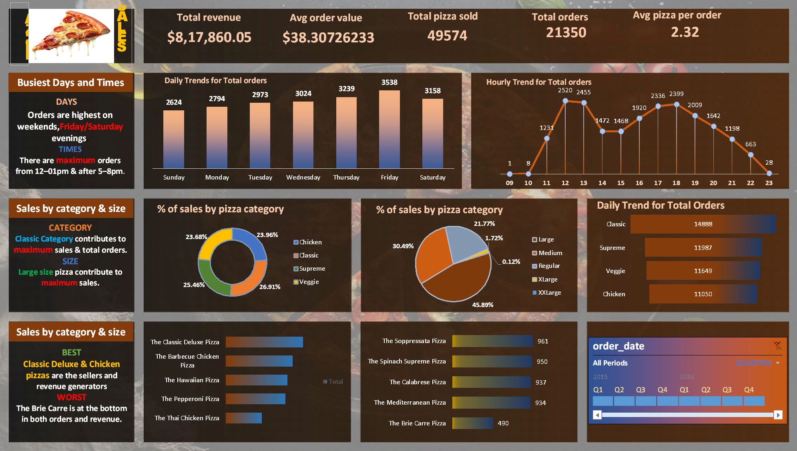

# 🍕 Pizza Sales Data Analysis (Day 1 - Project 1)

This project is part of my **30 Days of 30 Projects** challenge.

## 📊 Overview
Analyzed pizza sales data using SQL and built a dashboard in Excel to uncover business insights.

## 🔍 Key Insights
- Orders peak on weekends, especially Friday & Saturday evenings  
- Highest order volume between 12–1 PM and 5–8 PM  
- Classic category generates the most sales  
- Large-sized pizzas contribute the highest revenue  

## 🛠 Tools Used
- MS SQL Server  
- Excel  

## 🧾 SQL Query Validation & Reporting
All key insights and KPIs were validated using SQL queries.

- Extracted total revenue, total orders, and average order value  
- Analyzed daily and hourly order trends  
- Evaluated sales contribution by category and size  
- Identified top-selling and least-selling pizzas  

These queries ensure the accuracy of the dashboard and simulate a real-world data validation workflow.

## 📁 Files
- `Pizza_sales_dashboard2.png` → Dashboard  
- `Pizza_sales_dataanalyst_dashboard2.xlsx` → Analysis file  
- `pizza_sales excel.xlsx` → Raw dataset  

## 📌 Dashboard Preview

---
🚀 Day 1/30 – More projects coming soon!
